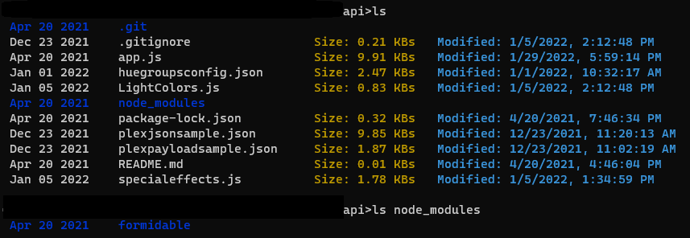

# **ABOUT**

LS_Windows is a simple NodeJS application to replace Windows ```dir``` command. <br>
It is intended to provide a more readable command line output than the "dir" command.

## **Configuration**

### Requirements: 
<li>NodeJS</li>
<li>Windows OS</li>
<br>

### Installation:
1. From the program directory run: ```npm link```. 
2. Use the ```ls``` command from a Command Prompt shell to get an output like the image below.<br>
You can also use ```ls folder/folder2/etc```

3. (Optional) If you want to choose a differnt command than ```ls``` open package.json and under bin: replace "ls" with desired command. <br>
Then run ```npm link``` again.

# **Preview of LS Windows**
